# Week1

## 编译

`makefile`略微修改

`windows:`使用`mingw`,保证环境和路径正确的情况下使用`mingw32-make`

`Ubuntu22.04`:`make`

### 快速入门makefile

`CC`指定`C`编译选项

`CXX`指定`C++`编译选项

### clean

```makefile
clean::
	rm -fr $(C_PROGS) $(C_PROGS_OBJ)
	rm -fr $(CXX_PROGS) $(CXX_PROGS_OBJ)
```

自动运行`rm`

### 定义文件

```makefile
$(C_PROGS): %:%.o
	$(CC) $^ $(LDFLAGS) -o $@
```

可以展开得到

```makefile
1-uppercase: 1-uppercase.o
	$(CC) $^ $(LDFLAGS) -o 1-uppercase
```

添加`Sanitizer`,在`LDFLAGS|CFLAGS|CXXFLAGS`中控制

```
-fsanitize=address,leak,undefined
```

`LDFLAGS`: Flags for the linker. 

## 1-uppercase

```shell
./1-uppercase "hello world"
HELLO WORLD
```

### clang-tidy

```
clang-tidy 1-uppercase.c

Error while trying to load a compilation database:
Could not auto-detect compilation database for file "1-uppercase.c"
No compilation database found in /home/cons/Desktop/uncomplete/week1 or any parent directory
fixed-compilation-database: Error while opening fixed database: No such file or directory
json-compilation-database: Error while opening JSON database: No such file or directory
Running without flags.
```

no errors,阅读源码得到

```cpp
void my_strcpy(char *dest, const char *src) {
	size_t i = 0;
	while (true) {
		dest[i] = src[i];
		if (src[i] == '\0') {
			break;
		}
		i++;
	}
}

char uppercase[strlen(argv[1])];   
my_strcpy(uppercase, argv[1]);
```

很显然没有给`\0`的空间,产生了一个`Byte`的越界

`clang-tidy`并不能处理到非库函数的不安全操作,无法捕捉动态行为

### Valgrind

```
valgrind ./1-uppercase "hello world"

==3357== Memcheck, a memory error detector
==3357== Copyright (C) 2002-2017, and GNU GPL'd, by Julian Seward et al.
==3357== Using Valgrind-3.18.1 and LibVEX; rerun with -h for copyright info
==3357== Command: ./1-uppercase hello\ world
==3357== 
HELLO WORLD
==3357== 
==3357== HEAP SUMMARY:
==3357==     in use at exit: 0 bytes in 0 blocks
==3357==   total heap usage: 1 allocs, 1 frees, 1,024 bytes allocated
==3357== 
==3357== All heap blocks were freed -- no leaks are possible
==3357== 
==3357== For lists of detected and suppressed errors, rerun with: -s
==3357== ERROR SUMMARY: 0 errors from 0 contexts (suppressed: 0 from 0)
```

`Valgrind`对于堆上内存的越界并没有监控

### Dynamic analysis

首先得到带调试信息的二进制文件

```shell
clang -g -O0 1-uppercase.c -o 1-uppercase
```

加入`Sanitizer`

```shell
clang -g -O0 -fsanitize=address,leak,undefined 1-uppercase.c -o 1-uppercase
```

运行

```
./1-uppercase "hello world"
```

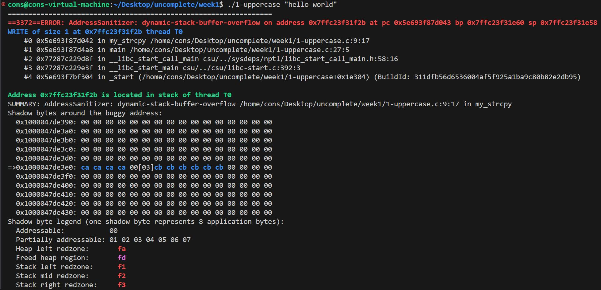

通过`Sanitizer`可以追踪到问题

`Sanitizer`会追踪已经分配的内存情况,每次进行访问时会检查目标地址是否在已分配的范围内.

## 2-linkedlist

注意到两个`bug`造成`memory leak`

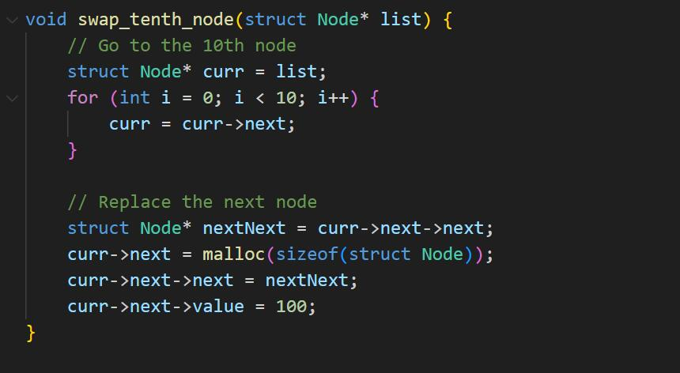

删除节点未释放

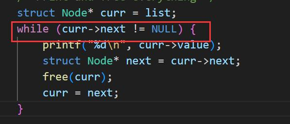

最后一个节点未释放

### clang-tidy

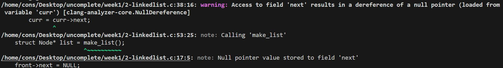

一些空指针误报,复杂的控制流可能使得`clang-tidy`无法很好的静态分析

### Dynamic analysis

#### Valgrind

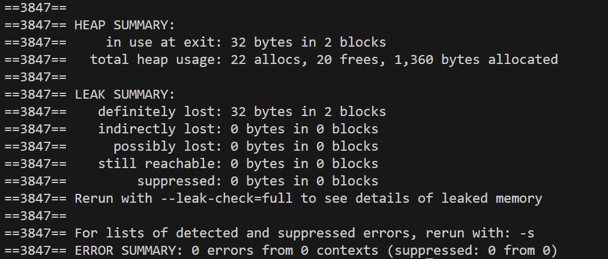

此时为堆内存分配,`Valgrind`找到了相关问题

#### sanitizer

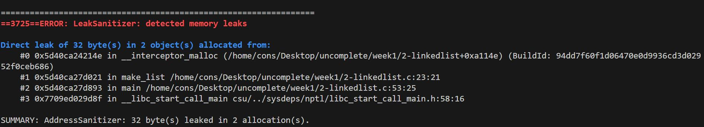

得到`memory leak`相关提示

## 3-bracket-parser

可以看到,如果调用的函数提前`return`,并没有释放`strdup`申请的空间

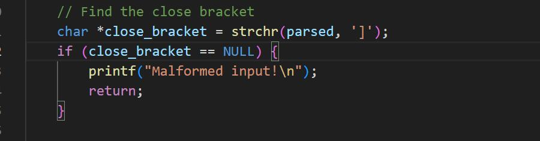

### clang-tidy

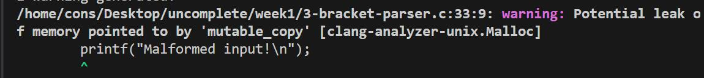

静态分析找到错误

### Dynamic analysis

```
./3-bracket-parser 'hi [hello world]!'
```

这种为正常情况,不会出现错误提示

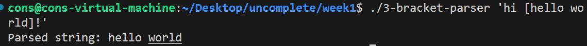

动态分析需要`fuzzing`,在某些数据上会表现出问题

```
./3-bracket-parser 'hi [hello wordddddddddddddddddlddsjfhjksafe!'
```

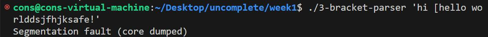

小概率事件

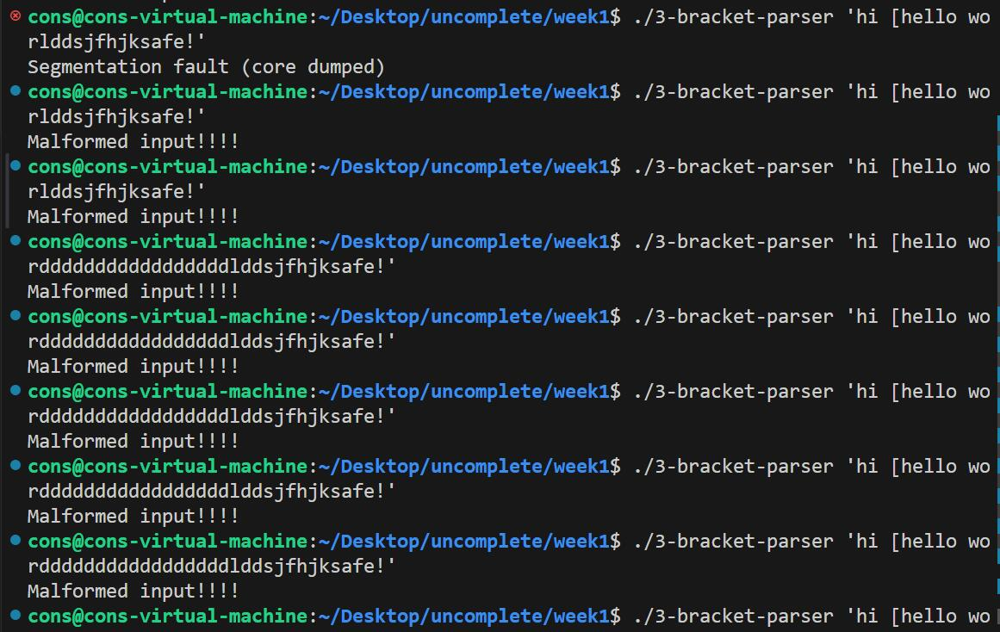

### fuzzing

修改代码,加入

```cpp
// @param data: pointer to buffer generated by fuzzer 
// @param size: size, in bytes, of the data at `data`
int LLVMFuzzerTestOneInput(const uint8_t *data, size_t size) {
    char buf[size + 1];
    memcpy(buf, data, size);
	buf[size] = '\0';

    return 0;
}
```

`libFuzzer`会将其自己的`main`函数注入到代码中，从而启动`fuzzer`(即开始生成输入并将其传递给`LLVMFuzzerTestOneInput`)。因此，需要注释掉`main`函数。

重新编译

```shell
clang -g -O0 -Wall -Wextra -std=gnu99 -fsanitize=fuzzer,address,leak,undefined -o 3-bracket-parser 3-bracket-parser.c
```

这样就可以`fuzzing`,但是我这里好像没检测到?

我把所有`free`都去掉了也不行,我猜测编译器自动`free`了或者有保护机制,留坑.

## 4-fibonacci

### clang-tidy

无错误

### Valgrind

无错误

### Sanitizer

输入`50`时会发生溢出

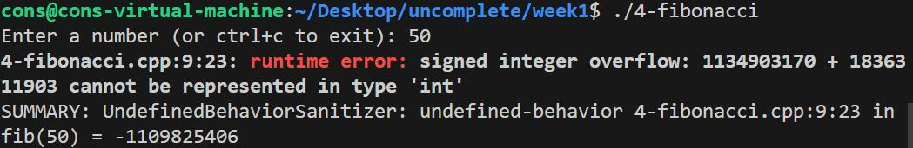

当然输入`123456789123456789`会使得`stoi`抛出异常

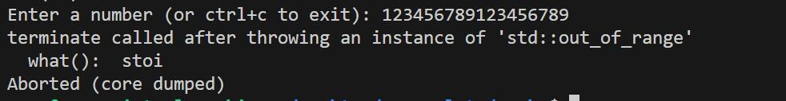

但是程序本身存在正确性问题

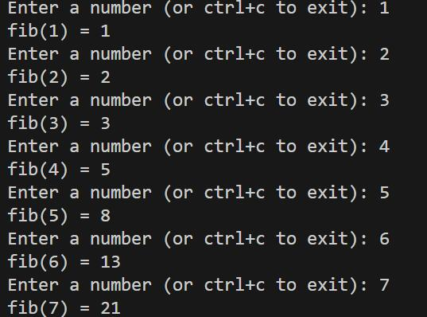

第一项应该为`0`,程序本身的正确性无法由检测工具得到.