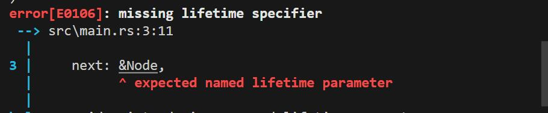
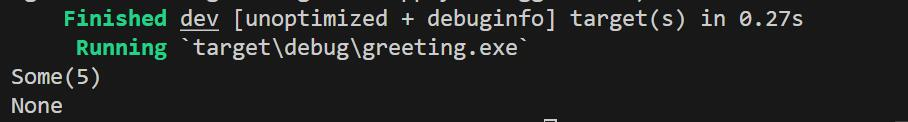

# lecture4

本节课我们需要实现链表

## Box

与`cpp`中的`unique_ptr`类似,唯一指向堆中某块内存的指针.

超出作用域的时候会自动释放,无法手动释放

```rust
let x: Box<u32> = Box::new(10); 
```

那么我们这样输出

```rust
println!("x = {}", x);
```

如果这样子输出,`*`

```rust
println!("x = {}", *x);
```

结果保持一致,这是一个特性,和`println!()`作为宏有关

## Node

```rust
struct Node{
    value: u32,
    next: Box<Node>,
}
```

有个问题,这里为什么不能`borrow`

```rust
struct Node{
    value: u32,
    next: &Node,
}
```



你`borrow`的东西在当前生命周期内存在,所以这里使用`Box`作为指针,指向堆中的一片空间.

这也是`reference`和指针`Box`的区别

但是会有`null`的情况存在,所以我们要用`Option`

```rust
struct Node{
	value: u32,
	next: Option<Box<Node>>,
}
```

## LinkedList

```rust
struct LinkedList{
	head: Option<Box<Node>>,
	size: usize,
}
```

## 构造函数

```rust
impl Node {
	pub fn new(value: u32,next: Option<Box<Node>>) -> Node {
		Node {
			value: value,
			next: next,
		}
	}
}

impl LinkedList {
	pub fn new() -> LinkedList{
		LinkedList{
			head: None,
			size: 0,
		}
	}
}
```

## 方法

rust在获取成员的时候会解引用多次,所以这样写是一样的

```rust
	pub fn get_size(&self) ->usize{
		self.size
	}
```

```rust
	pub fn get_size(&self) ->usize{
		(*self).size
	}
```

最好不要明确的解引用

```rust
impl LinkedList {
	pub fn new() -> LinkedList{
		LinkedList{
			head: None,
			size: 0,
		}
	}

	pub fn get_size(&self)->usize{
		self.size
	}

	pub fn is_empty(&self)->bool{
		self.head.is_none()
	}
}
```

## assert

作为单元测试使用

```rust
fn main(){
	let list: LinkedList = LinkedList::new();

	assert!(list.is_empty());
}
```

当中间为假,错误

测试两个东西是否一致

```rust
	assert_eq!(list.get_size(),0);
```

## take

如果我们这样子实现`push`

```rust
	pub fn push(&mut self,value: u32){
		self.size += 1;
		let node: Box<Node> = Box::new(Node::new(value, self.head));
	}
```

编译会报错


没有实现`Copy`,我们这里是可变引用,无法给出控制权

如何转换控制权?

现在我们有如下代码

```rust
	let mut x : Option<u32> = Some(5);
	let x_ref : &mut Option<u32> = &mut x;

	println!("{:?}",x_ref.take());
	println!("{:?}",x);
```

结果如下



这里`take`拿去了实际的控制权,原变量已经失效,底层实际做了一些不安全的操作

所以实际实现就变成了

```rust
	pub fn push(&mut self,value: u32){
		let new_node: Box<Node> = Box::new(Node::new(value, self.head.take()));
		self.head = Some(new_node);
		self.size += 1;
	}
```

## 遍历

```rust
	pub fn display(&self){
		let mut current : &Option<Box<Node>> = &self.head;
		loop {
			match current{
				Some(Node) =>{
					print!("{} ",Node.value);
					current = &Node.next;
				}
				None =>{
					println!();
					break;
				}
			}
		}
	}
```

## 解包

我们要实现`pop`,这样写肯定是可以的

```rust
	pub fn pop(&mut self) -> Option<u32>{
		let node = self.head.take();
		match node{
			Some(x)=>{
				self.size -= 1;
				self.head = x.next;
				Some(x.value)
			}
			None=>{
				None
			}
		}
	}
```

但是这样太长了,`match`过多也是`bug`的来源之一

一次解包可以这样

```rust
let node: Box<Node> = self.head.take()?;
```

如果`Option`不是`None`，则`?`语法将解开`Option`并将其绑定到`Node`否则函数将直接返回`None`

然后我们就有了这样代码

```rust
pub fn pop(&mut self) -> Option<u32> {
  let node = self.head.take()?;
  self.head = node.next;
  self.size -= 1;
  Some(node.value)
}
```

## 完成

```rust
use std::{collections::btree_map::Values, option};

struct LinkedList{
	head: Option<Box<Node>>,
	size: usize,
}

struct Node{
	value: u32,
	next: Option<Box<Node>>,
}

impl Node {
	pub fn new(value: u32,next: Option<Box<Node>>) -> Node {
		Node {
			value: value,
			next: next,
		}
	}
}

impl LinkedList {
	pub fn new() -> LinkedList{
		LinkedList{
			head: None,
			size: 0,
		}
	}

	pub fn get_size(&self)->usize{
		self.size
	}

	pub fn is_empty(&self)->bool{
		self.head.is_none()
	}

	pub fn push(&mut self,value: u32){
		let new_node: Box<Node> = Box::new(Node::new(value, self.head.take()));
		self.head = Some(new_node);
		self.size += 1;
	}

	pub fn pop(&mut self) -> Option<u32>{
		let node: Box<Node> = self.head.take()?;
		self.head = node.next;
		self.size -= 1;
		Some(node.value)
	}

	pub fn display(&self){
		let mut current : &Option<Box<Node>> = &self.head;
		loop {
			match current{
				Some(Node) =>{
					print!("{} ",Node.value);
					current = &Node.next;
				}
				None =>{
					println!();
					break;
				}
			}
		}
	}
}

fn main(){
	let mut list: LinkedList = LinkedList::new();

	for i in 1..10{
		list.push(i);
	}
	list.display();
	println!("List size: {}",list.get_size());
	
	println!("Pop top = {}",list.pop().unwrap());
	
	list.display();
	println!("List size: {}",list.get_size());
}
```

