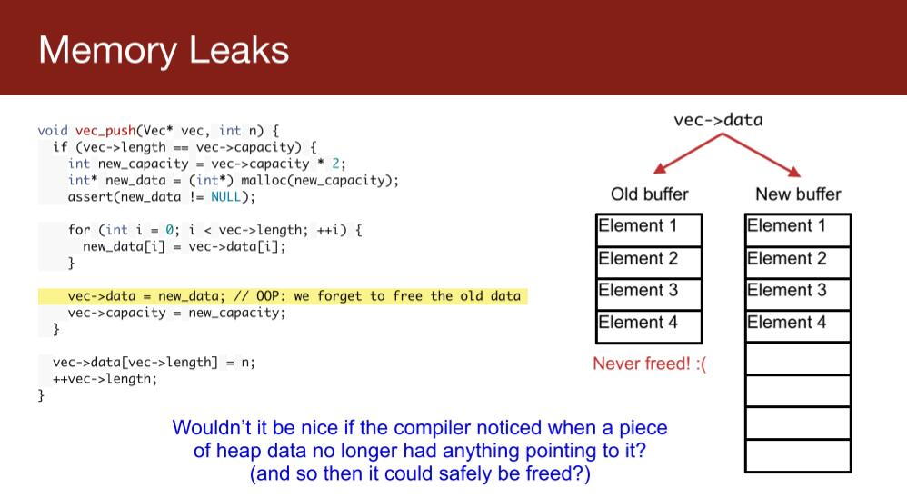
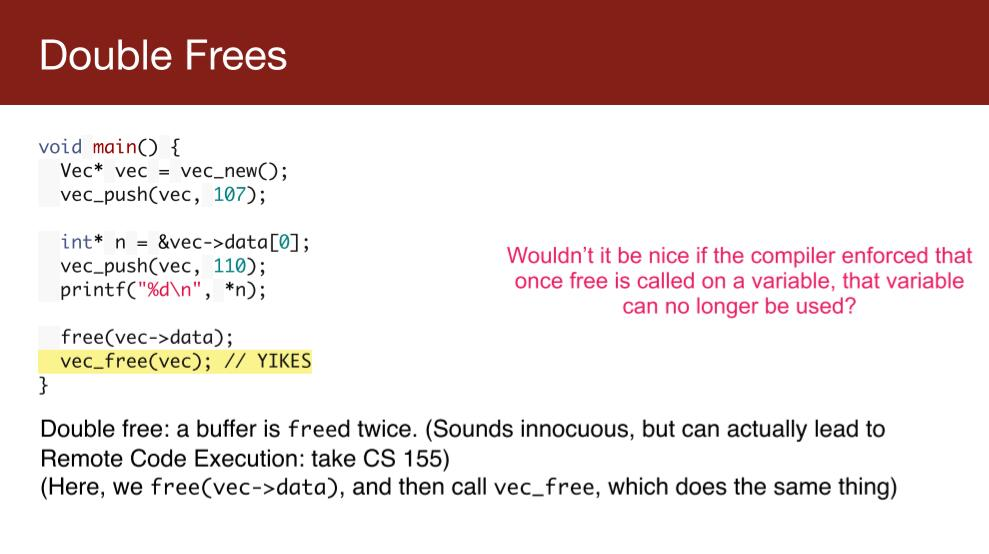
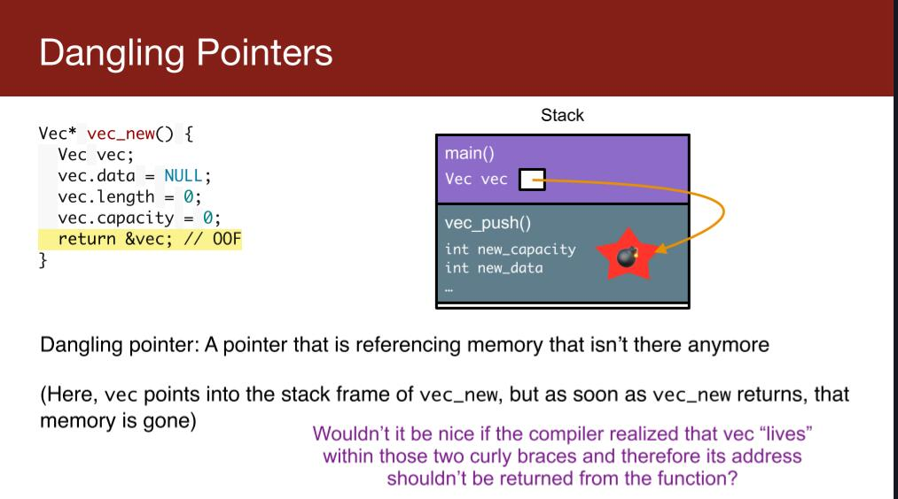
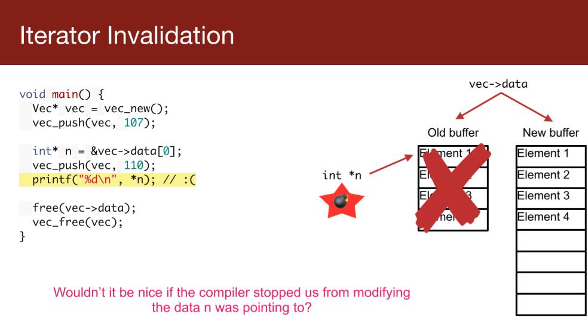
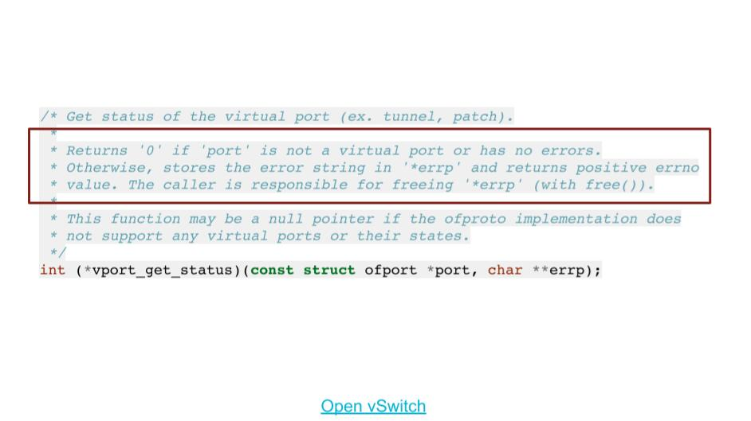
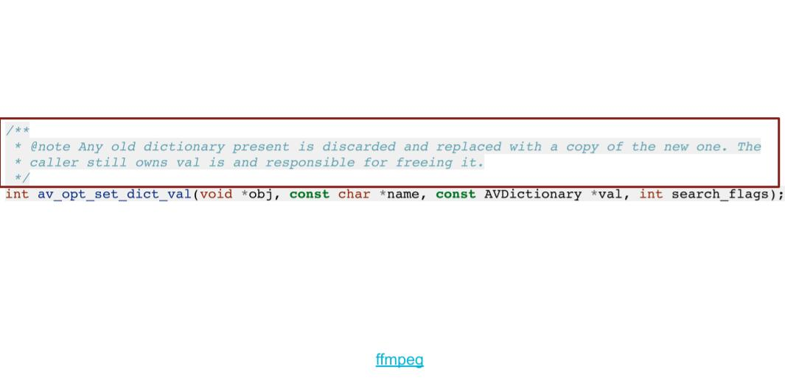
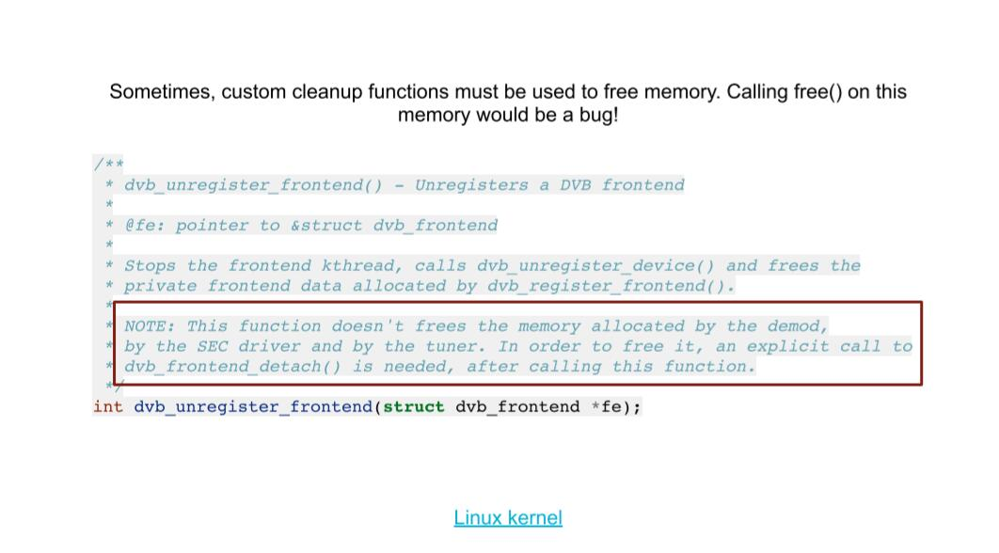
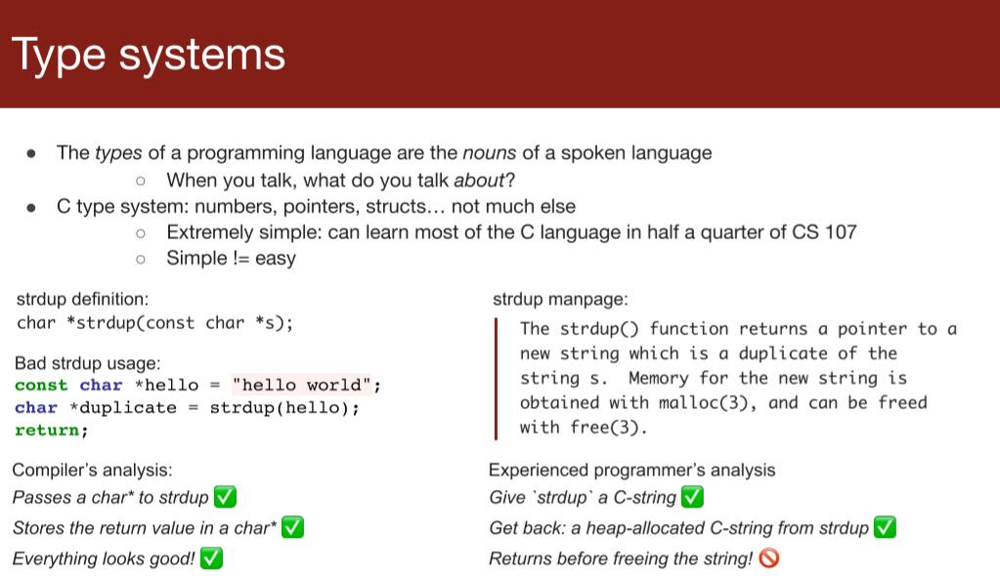
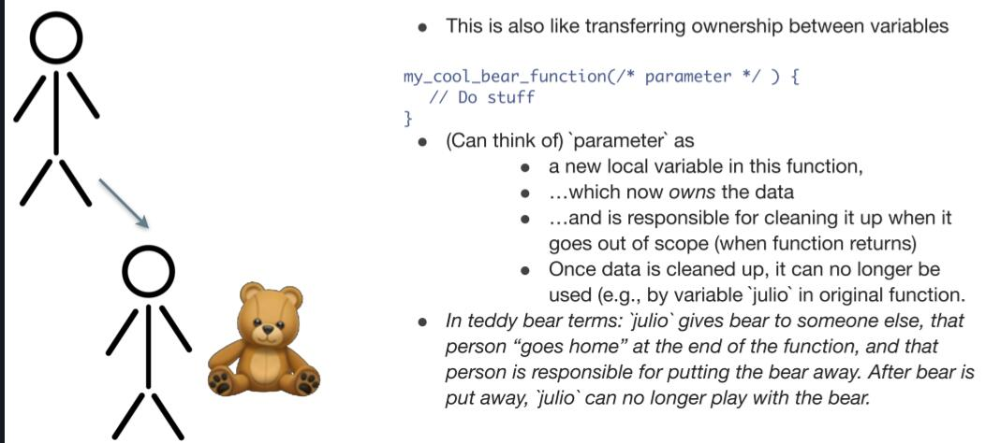

# lecture3

## Memory Errors

 find errors by reasoning and testing(推理于测试)

### memory Leak



### double free



### dangling pointers



### Iterator Invalidation



## Good Code Need?

decompose problem into small pieces 分解问题

Pre/postcondition 前置/后置条件

前置/后置条件为问题分解后的代码组合提供了接口.

代码段只需要验证是否满足前置条件,处理后将目标设置到一定状态.

### 内存管理

在`C/C++`中自然的出现了内存所有权的概念





但有时候问题会变得非常复杂,需要自定义函数



在`C/C++`中,这些控制均由程序员完成,编译器并不知道你的前后控制条件

### Type System



在`strdup`中存在着后置条件,需要程序员进行主动`free`

## Meet Rust

### Ownership

```rust
let a = Bear::get();
let b = a; // now b is responsible for the object,a can not do anthing to the object
```

此时b拥有了所有权

当我们将bear交给函数

```rust
let a = Bear::get();
func(a); //now func is responsible for the object
```

函数将获得bear的所有权,需要释放.



但是`rust`有**借用**的特性

```rust
let a = Bear::get();
func(&a); //now after finish func, the ownership will return to a
```

这里的函数为借用变量,结束后归还.

同时`for`循环的表现也有所不同

```rust
    let v = vec!["1", "2", "3"];
    for x in v {
        println!("{}", x);
    }
    println!("{:?}",v);
```

此时会产生报错,编译器认为`v`的所有权交给了循环,应写成如下形式

```rust
    let v = vec!["1", "2", "3"];
    for x in &v {
        println!("{}", x);
    }
    println!("{:?}",v);
```


所以`rust`有以下特性:

* 每个值会存在一个变量作为`owner`
* 同时只有一个`owner`
* 当`owner`超出了作用域了以后,值会被自动回收(`compiler`插入释放代码)

这样的设计能够防止以下问题:

* memory leaks
* double free
* use after free
* many others... 

