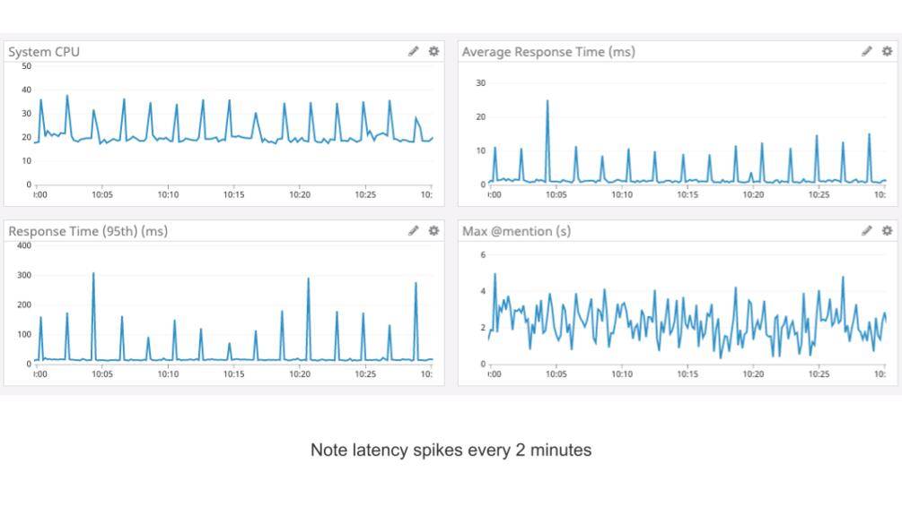
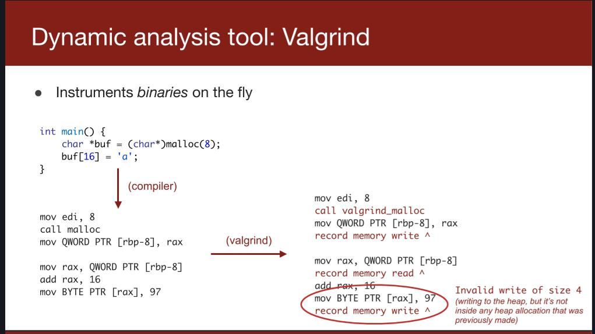
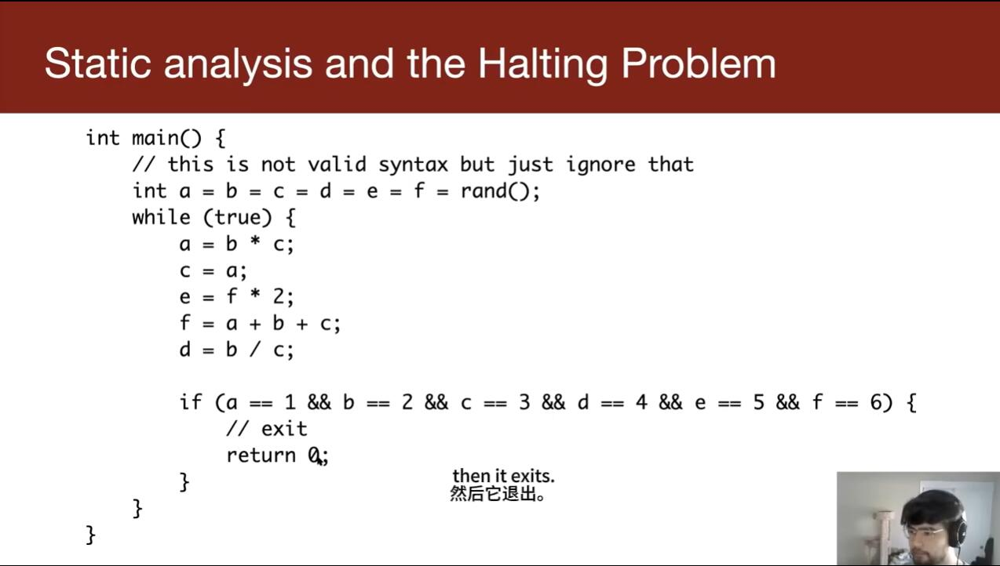

# lecture 1

通过`cs110L`你能夯实你在`CS110`学到的东西.

## Why not C/C++?

这里有一份简单的代码:

```cpp
#include <stdio.h>
#include <string.h>

int main() {
    char s[100];
    int i;

    printf("\nEnter a string : ");
    gets(s);

    for (i = 0; s[i] != '\0'; i++) {
        if (s[i] >= 'a' && s[i] <= 'z') {
            s[i] = s[i] - 32;
        }
    }

    printf("\nString in Upper Case = %s", s);

    return 0;
}

```

首先让我们了解一下我们的变量的存储形式


如果输入的字符串长度太长(这里是超过`99`个字符)......


输入的字符串会覆盖函数的返回地址,当函数返回后程序运行将不受控制.

通过精心构造字符串,我们能够让程序运行到我们想要运行的地方,比如一些特权函数.

这样就完成了一次栈溢出攻击.

### Morris Worm

针对网络监听程序`FingerD`的一个病毒


甚至一个字节的溢出也可以完成攻击


```cpp
char buffer[128];
int bytesToCopy = packet.length;

if (bytesToCopy < 128) {
    strncpy(buffer, packet.data, bytesToCopy);
}
```


不安全的类型转换.

### Why not use GC’ed languages?

过多的增加了开销。

会在任务执行到一半的时候执行，造成性能损失



## Dynamic analysis

工具:`Valgrind`,基于二进制文件运行,反编译后增加代码,多次分块执行,观察内存状态.



但是程序是不确定的,依赖于输入运行,只能在程序出问题的时候找到问题.

`fuzzing`: 模糊测试,生成大量随机数据作为输入来进行测试.

虽然经过了大量测试,我们仍旧无法保证代码一定没有`bug`

## Static analysis

阅读源代码,对不安全函数报错

但是本身限制很大.

### Halting Problem

是否存在一个程序，对于任意输入，能够判断程序会在有限时间内结束或者死循环。

已经证明不存在解决停机问题的通用算法。

这展示了不能通过阅读程序本身来解决这个问题。



看起来可以停止......吗?过于复杂的计算以至于无法直接分析.