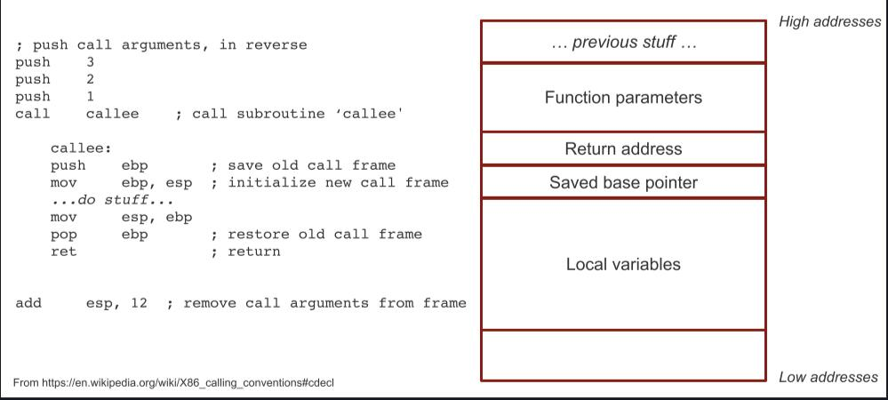
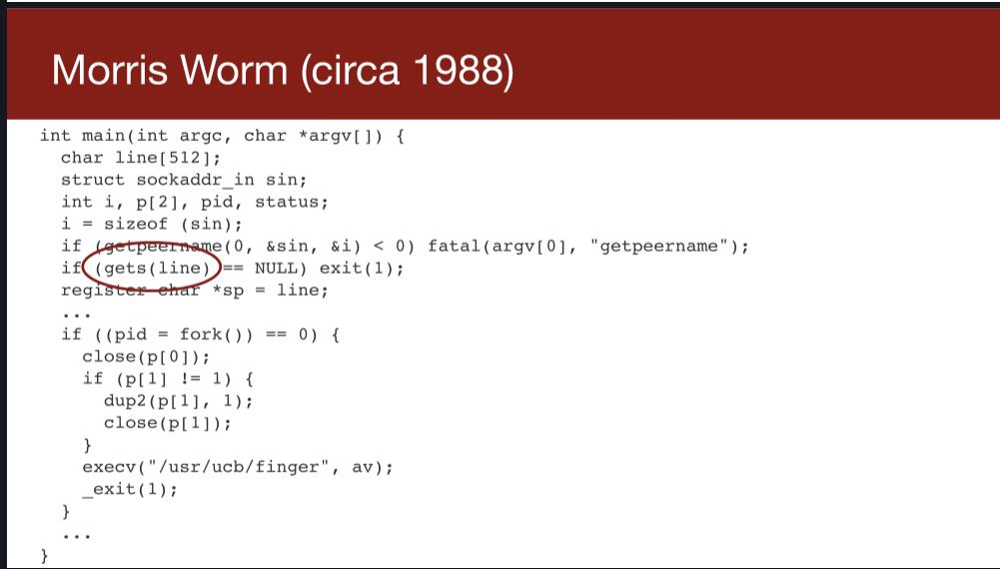
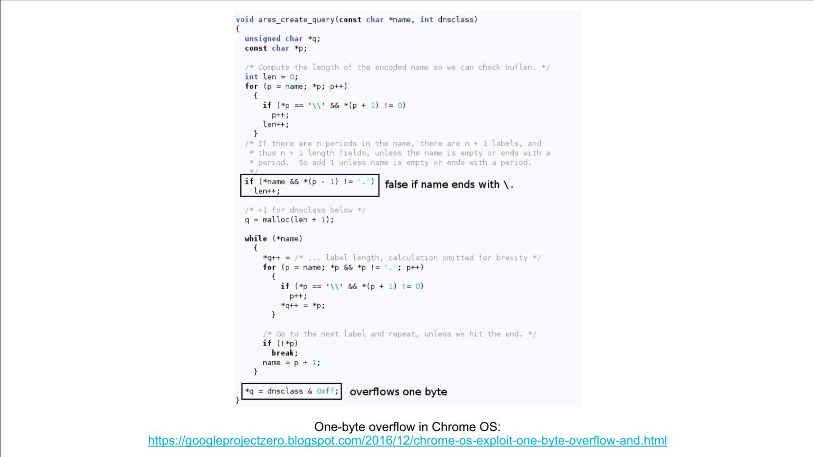
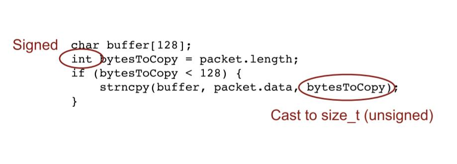

# lecture 1&2

You can enhance what you learn in CS110: Principles of Computer Systems.

## Why not C/C++?

Here is a simply code:

```cpp
#include <stdio.h>
#include <string.h>

int main() {
    char s[100];
    int i;

    printf("\nEnter a string : ");
    gets(s);

    for (i = 0; s[i] != '\0'; i++) {
        if (s[i] >= 'a' && s[i] <= 'z') {
            s[i] = s[i] - 32;
        }
    }

    printf("\nString in Upper Case = %s", s);

    return 0;
}

```

We should know how the local variables store in the storage.



If string is too long... 


It will cover the return address,the program will run to somewhere we don't know.

Even worse, we can control the program run to everywhere!

overflow attack!

### Morris Worm



Even one bytes overflow is enough.



```cpp
char buffer[128];
int bytesToCopy = packet.length;

if (bytesToCopy < 128) {
    strncpy(buffer, packet.data, bytesToCopy);
}
```



that's unsafe.

## Dynamic analysis

`fuzzing`: 模糊测试


