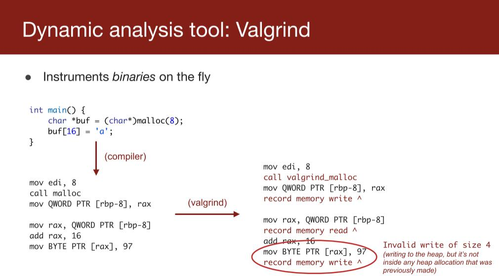
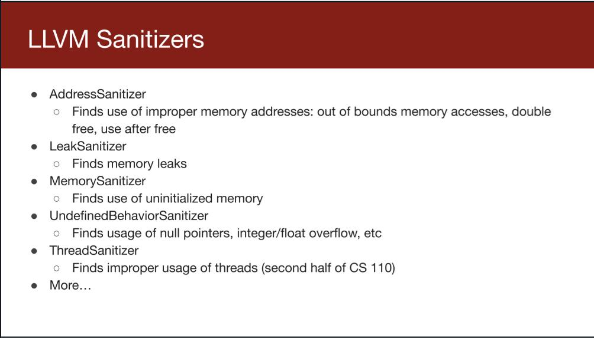
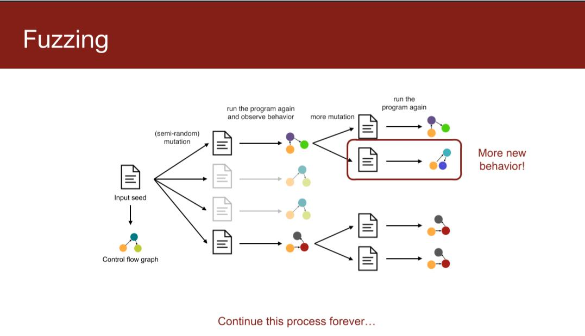
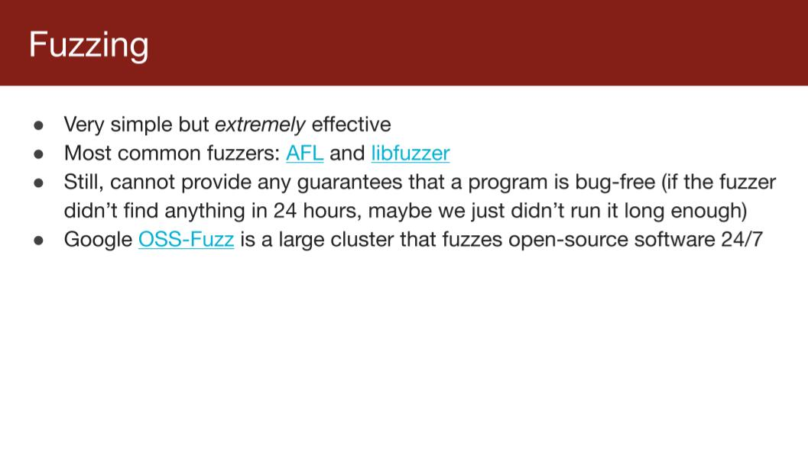
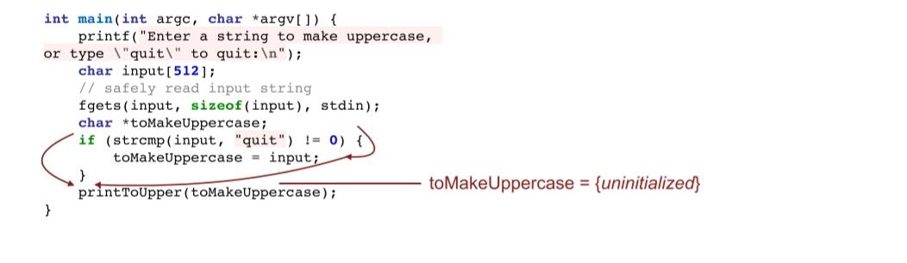
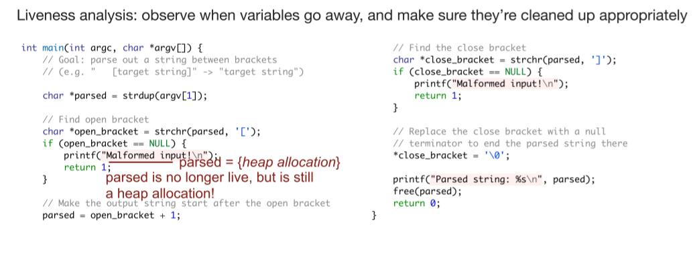
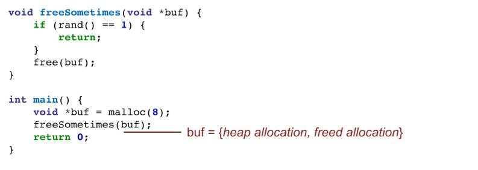
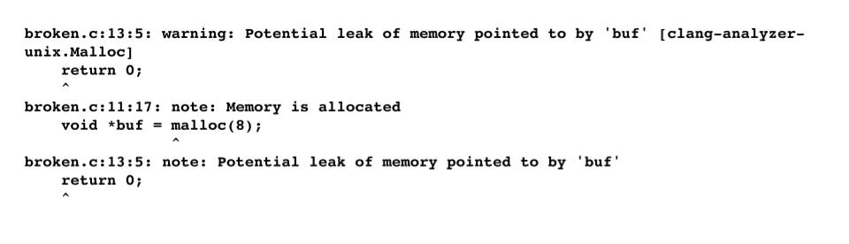
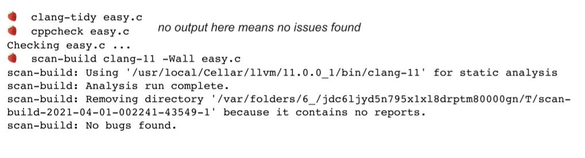

# lecture2

## Dynamic Analysis

运行,调试...

但是某些问题仅在特殊的状态下出现.

### Valgrind

`Valgrind`实时监控内存情况

patch assembly and execute

但是二进制文件中的信息不够多，比如栈位置，只监控堆上分配的空间。

### Sanitizer

instrument source code 检测源代码,源代码中的信息会更多

`LLVM`的一部分

但是动态分析智能在**出现问题**的输入 & 运行后展示错误.

### fuzzing

模糊测试

随机生成大量的数据,观察控制流,**简单有效**的找到引发错误的**数据**.

但是仍不能保证程序完全没有 `bug`.

## Static Analysis

### linting

直接搜索不安全函数.

e.g. Clang-tidy

### Dataflow analysis

clang-tidy 也可以进行数据流控制.

以下有一个例子

当然`Dataflow analysis`会存在误报(`False positive`)

太多的误报会造成效果下降

同时静态分析常常对单文件进行,不满足大型项目的需求

更多分析内容见`CS243`

## examples

这段代码并不会报错

如果复制`16`个字符会发生什么?

## 静态分析的基本限制

* 根据几行代码无法得到是否安全的结果
* 难以将某个特定边界推广到一般情况
* 总会出现破坏额外添加规则的情况
* 

